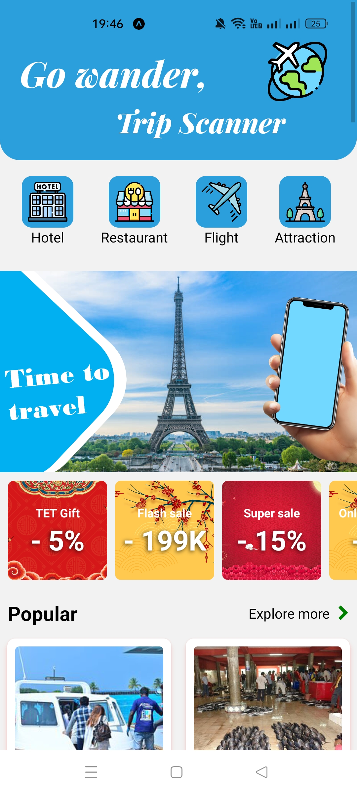
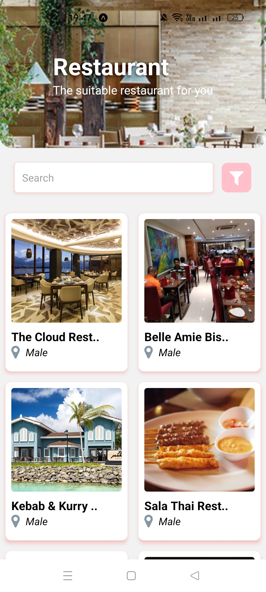
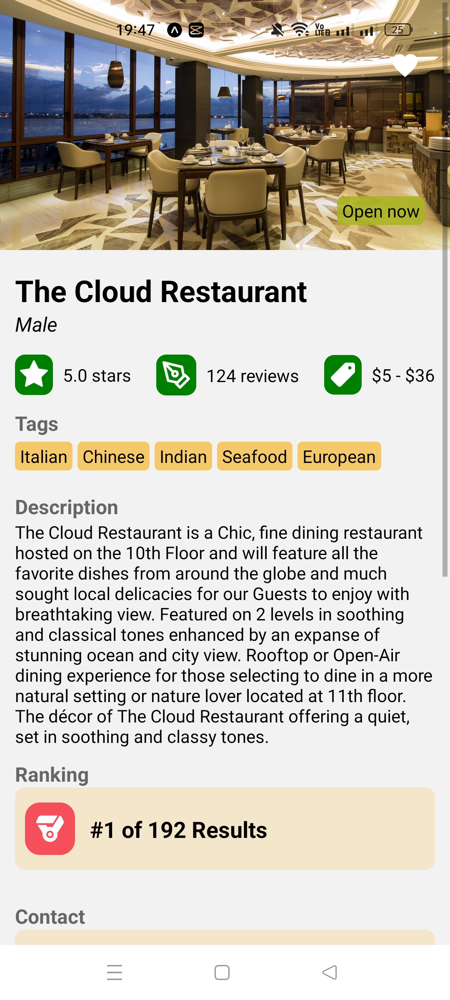

<h1> Trip Scanner </h1>

<h3>A simple app to find hotels, restaurants, flights and attractions.</h3>

This is my first app using React Native. Make basic UI and use <a href="https://rapidapi.com/apidojo/api/travel-advisor" >rapidApi.</a>

## Demo

Main Screen:

 

List Screen:

 

Detail Screen:

